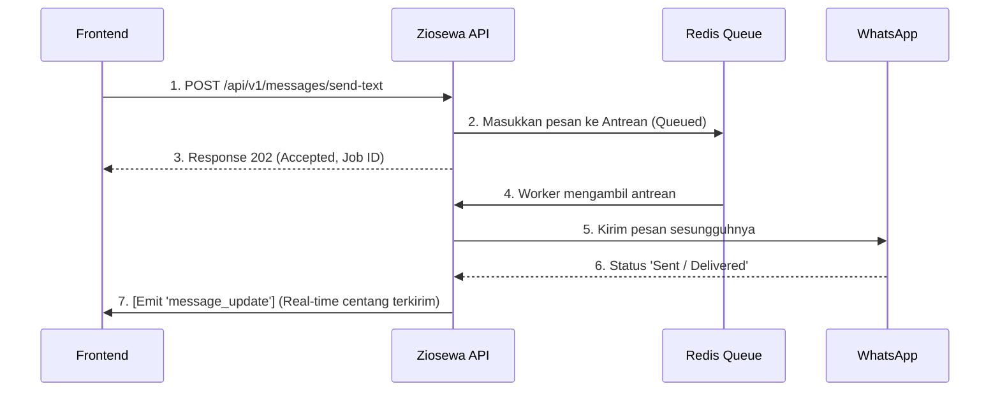
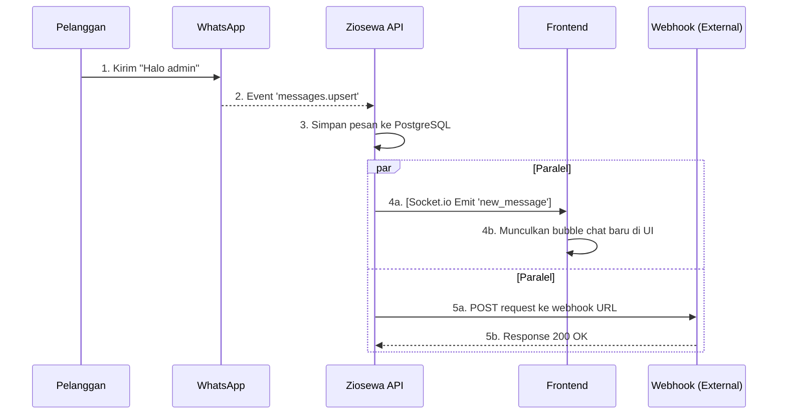

# Ziosewa CRM API - Developer Guide

Dokumen ini ditujukan untuk tim Frontend / Developer agar dapat memahami arsitektur komunikasi dan alur kerja (flow) dari Ziosewa CRM API.

## 1. Arsitektur Komunikasi
Sistem ini menggunakan 2 jalur komunikasi paralel:
1. **REST API**: Untuk aksi aktif yang dipicu oleh *user* (seperti mengirim pesan, generate QR, melihat riwayat chat).
2. **WebSocket (Socket.io)**: Untuk *real-time event* dari server ke Frontend (seperti QR Code baru muncul, pesan masuk, atau status WhatsApp terputus), sehingga Frontend tidak perlu melakukan *polling*.

### Autentikasi
Setiap permintaan ke REST API (kecuali `/docs`) wajib menyertakan API Key dari tabel `Tenant`:
```http
Authorization: Bearer <api_key_tenant>
```

---

## 2. Alur Integrasi (Flows)

### A. Alur Menghubungkan WhatsApp (Scan QR)
Alur ini dijalankan saat pengguna pertama kali menghubungkan nomor WhatsApp mereka ke CRM.

```mermaid
sequenceDiagram
    participant FE as Frontend
    participant API as Ziosewa API
    participant DB as PostgreSQL
    participant WA as Meta (WhatsApp)

    FE->>API: 1. POST /api/v1/devices (Create Device)
    API->>DB: 2. Simpan status 'pairing'
    API->>WA: 3. Minta sesi login baru
    WA-->>API: 4. Kembalikan raw QR string
    API-->>FE: 5. Response 200 (Device Created)
    
    rect rgb(20, 50, 70)
        Note right of FE: --- Komunikasi via WebSocket ---
        API->>FE: 6. [Emit 'qr_update'] (Base64 Image)
        FE->>FE: 7. Tampilkan QR di Layar Web
    end

    WA->>WA: 8. User scan QR pakai HP
    WA-->>API: 9. Event: Connected!
    
    rect rgb(20, 50, 70)
        Note right of FE: --- Komunikasi via WebSocket ---
        API->>FE: 10. [Emit 'connection_update'] (status: connected)
        FE->>FE: 11. Ganti UI ke halaman Dashboard Chat
    end
    
    API->>DB: 12. Tarik & Simpan 500 riwayat chat ke DB
```



### B. Alur Mengirim Pesan (Outbound)
Sistem menggunakan *Message Broker* (Redis + BullMQ) untuk memastikan pesan tidak hilang jika server WA sedang lambat/terputus.



### C. Alur Menerima Pesan (Inbound)
Saat ada pesan masuk dari pelanggan, Backend akan menyimpannya secara lokal dan memberi tahu Frontend secara *real-time*. Di saat yang sama, Backend juga akan mengirimkan Webhook (HTTP POST) ke server lain jika Anda memiliki sistem *chatbot* terpisah.


